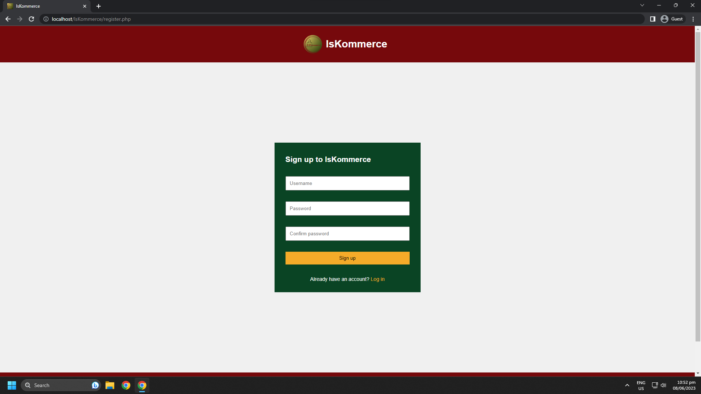
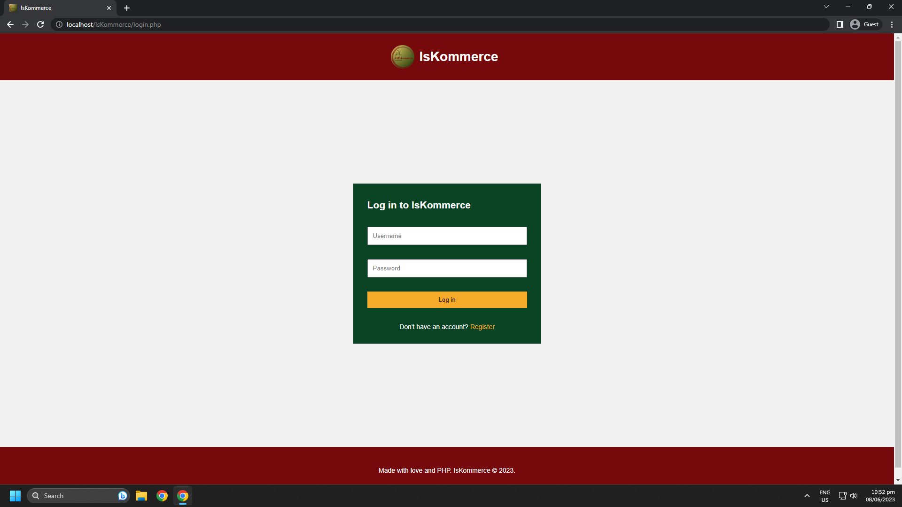
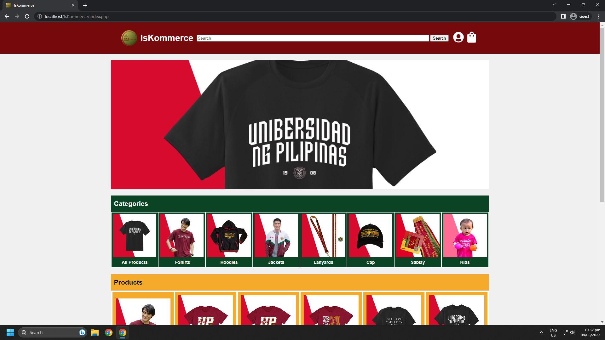
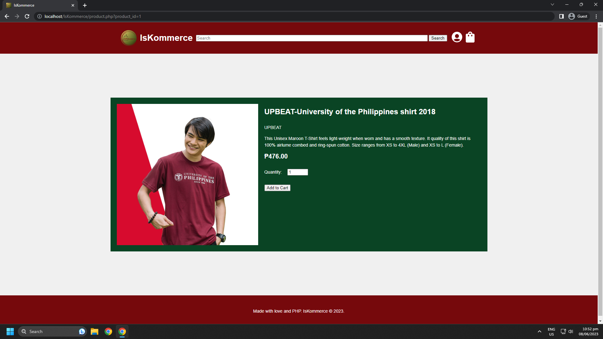
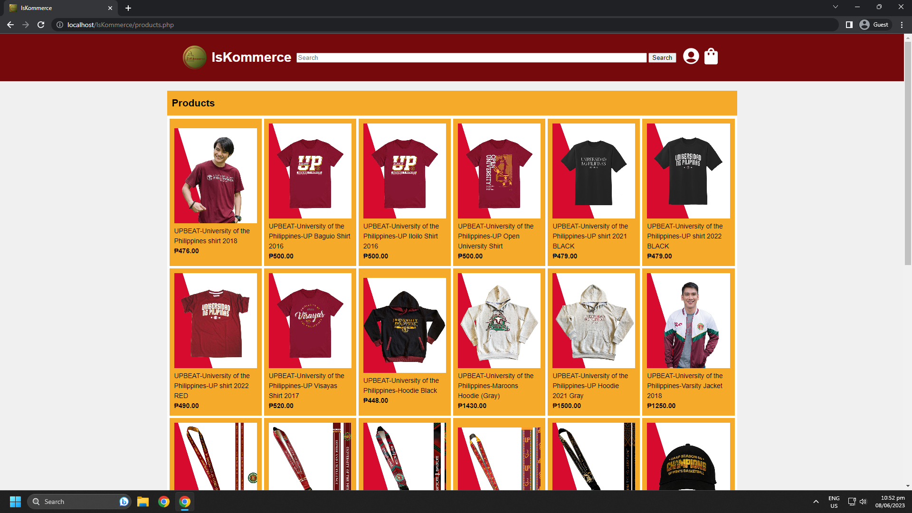
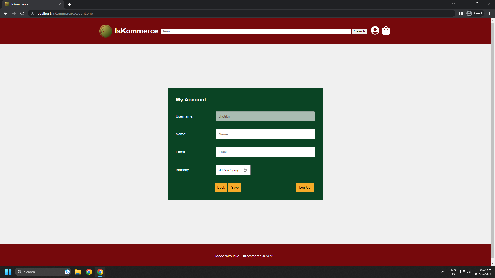
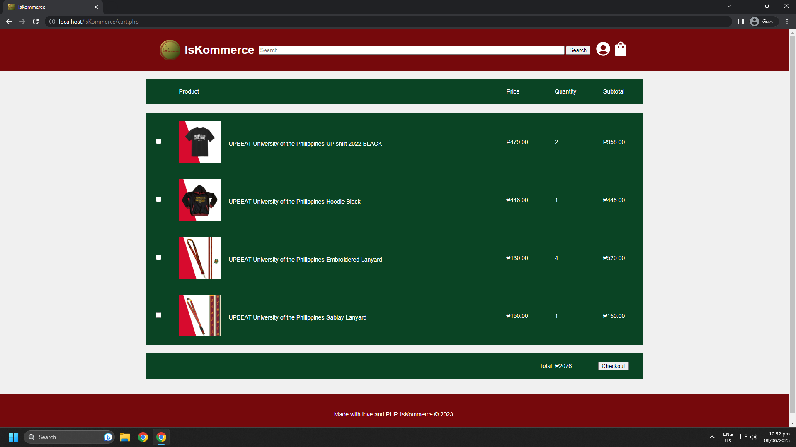
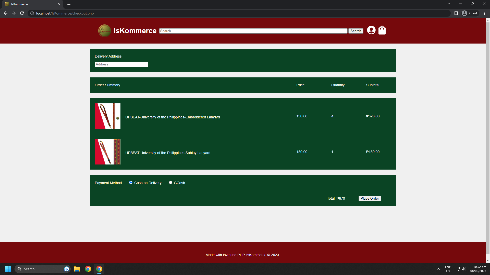
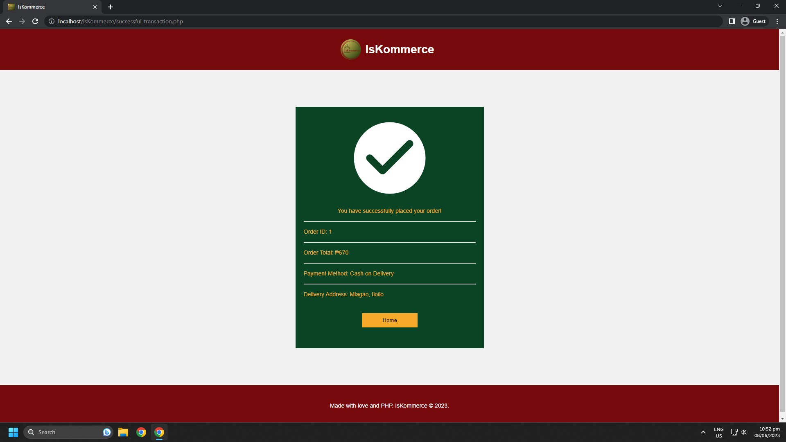

# IsKommerce

## About

IsKommerce is the solution to the problem of UPV organizations struggling to sell their merchandise due to limited exposure and lack of online presence.

Our website also provides a convenient platform for UPV students, alumni, and supporters to purchase UPV merchandise online. With user-friendly interfaces, reliable payment systems, and efficient delivery or pick-up processes, we aim to create and offer a hassle-free shopping experience.

Our project seeks to increase the accessibility and availability of UPV merchandise to a wider audience, strengthening school spirit and pride among the UPV community.

## Demo

## Authors

- Caceres, Ricca Shaine P.
- Cahilig, Maxinne Gwen V.
- Gallego, Chester Ken G.
- Ong, Jaren Matthew V.
